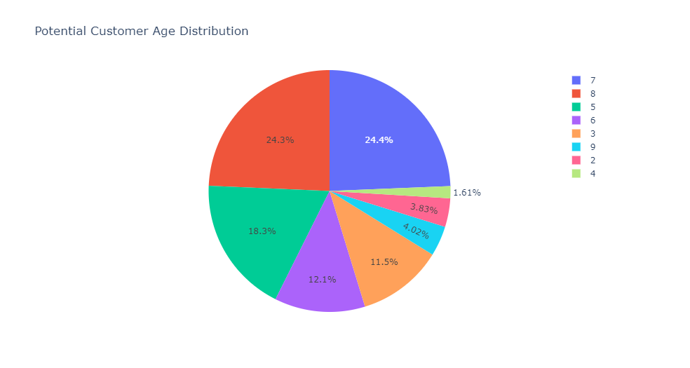

# Aggregate Statistics and Data Visualizations

## Explore differences in variable distributions between Potential Customers (people who clicked on ads) and Non-Potential Customers (people who did not click on ads)

### Variable Age:

- We started by visualizing the age distribution with two separate pie charts. One for potential customers, and one for non-potential customers.

