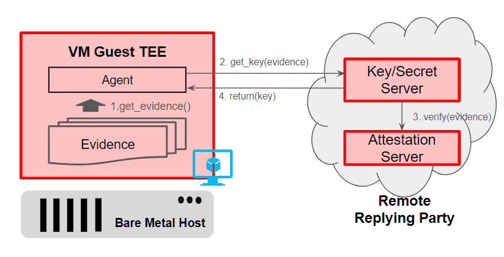

# Task I: Data Clean Room, Privacy Preservation

## Table of Contents
[Data Clean Room Setup](#data-clean-room)

[TPM Coding + Remote Key Attestation](#tpm-coding-for-remote-key-attestation)

[Code/Scripts Overview](#codescripts-overview)

Overview of Virtual Machine configuration:


## Data Clean Room

DCR's involve two parties and their purpose is to allow for a secure environment for data analysis and processing, keeping private information from being leaked. DCRs mitigate privacy risks and ensure that data stays encrypted within it. 

The task in this hackathon is to create a Trusted Execution Environment where we can run the code on the datasets for the two parties. Specifically in this project we will be using a Microsoft Azure VM, with 

### Setup Configuration of Azure Virtual Machine for Trusted Execution Environment:

After making a Microsoft Azure account, we create a VM with the following configuration:


*Ensure that "Trusted Launch Virtual Machines" is selected for security type, and use any linux distribution for the image.*


*Pick a size that works for the specifications for the task. Typically, any DC-family size (DCasv, DCesv, DCsv, etc.) will work*


*We chose to use ED 25519 SSH format for size reasons*

Upon successful creation of the VM, we need to save the key-value pair of the user so we can log in to the VM. We use PuTTy to establish SSH connection to the virtual machine. The private key is used to authenticate the user.

### Install and Setup SGX + Other Dependencies

After successfully connecting to the VM, we want to install the appropriate dependencies to run data processing, analysis, and machine learning tasks. 

Before doing anything we ensure we have the latest packages for all dependencies in the system by running: 

```sh
sudo apt-get update
```
```sh
sudo apt-get upgrade
```
*As a side note, these two commands solved a majority of the errors and bugs we ran into during development*

Then, we install dependencies with the following command:
```sh
sudo apt install python3-pip tpm2-tools 
```

Install appropriate python libraries
```sh
sudo pip3 install pandas ctgan scitkit-learn imblearn
```

- Pandas: Used for all of our data cleaning and data processing tasks.
- CTGAN: Main implementation/approach for tabular synthetic data generation 
- scikit-learn: Used for Random Forest Generation
- imblearn: Used for balancing the dataset to minimize Type II Errors

For SGX setup we install the following packages
```sh
sudo apt install sgx-dcap-pcss sgx-pck-id-retrieval-tool
```

Optional: can also install Azure CLI for a more streamlined workflow during this process. (Everything that needs to be done on the Azure CLI can also be done on the Azure portal)

```sh
curl -sL https://aka.ms/InstallAzureCLIDeb | sudo bash

az login
```

### Setup Key Value Server in Microsoft Azure


Ensure that we only allow selected networks to access the Key Vault for an additional layer of security. We select the virtual network corresponding to our VM as the network that is allowed to access the key vault. 

After setting up the key value server in Azure, we also want to add certain users as "Key Value 

### TPM Coding for Remote Key Attestation

For TPM Coding we follow the instructions given in the tutorial: [Tutorial](https://gist.github.com/kenplusplus/f025d04047bc044e139d105b4c708d78)

The general workflow of the Remote Key Attestation process is as shown below:



Evidence is the data that is generated within the TEE that describe its current state. The evidence proves that the data within the TEE is secure and has not been tampered. Typically includes hashes, and other software configurations. 

The agent (a software component inside the TEE), will send this evidence to the Remote Key Vault, to initiate the process of requesting a key. 

Inside the Key Vault, the server will send the evidence to the Attestation Server to verify that it is authentic. After it has been authenticated, the attestation server sends the key back to the virtual machine. 

## Code/Scripts Overview

### Step 1: Get Evidence 

First create the endorsement key to initialize the TPM

```sh
tpm2_createek --ek-context rsa_ek.ctx --key-algorithm rsa --public rsa_ek.pub
```

Then, create the Attestation Key, which we will next send to the Key Vault that we have prepared

```sh
tpm2_createak \
   --ek-context rsa_ek.ctx \
   --ak-context rsa_ak.ctx \
   --key-algorithm rsa \
   --hash-algorithm sha256 \
   --signing-algorithm rsassa \
   --public rsa_ak.pub \
   --private rsa_ak.priv \
   --ak-name rsa_ak.name
```

### Step 2: Send AK to Key Vault

At this step, the user will run the script [SendAK.sh](https://github.com/akannan05/ges24/blob/main/Part%20I%20-%20DCR/src/SendAK.sh) which will save the public attestation key (rsa_ak.pub) into the Key Vault server for further usage


