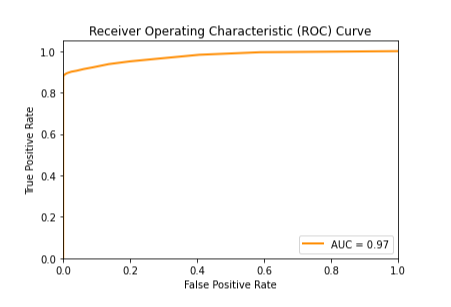
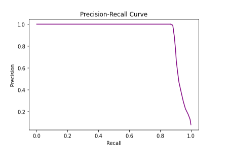
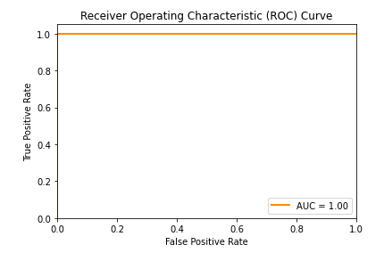
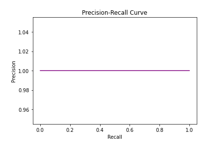

# Task II: Predictive Modelling

## Feature Engineering
The first step we took in feature engineering was to eliminate any columns which we thought would not have any predictive power towards identifying potential customers. These variables were usually ID columns. We dropped the following variables: log id, user id, adv id, slot id, adv prim id, label_x, site id, spread app id, i source id, and i doc id. We also dropped other columns such as i_entities, i_cat, and i_regionEntity as these data types did not work well within the model and they did not contribute much predictive power.

The next issue we came across was that some columns were lists of advertisements or news categories (separated by a carrot). These lists do not provide much predictive power; however, we feature engineered these features to show how many advertisements were liked, closed, interesting, etc.

The final issue we came across was that a lot of the entries in the merged dataframe were null. To fix this we used regression-based imputation, where the non null columns are used to "predict" the values of the null columns. We used linear regression as the linear model for the imputation.

## Model, First Attempt

After the feature engineering was completed, we started by training a random forest model. A random forest model in essence is an ensemble of decision trees which makes predictions via a majority vote of the decision trees. We thought this would be a good model because the decision trees would be good because it would use a human-like decision making process to find solutions.

The first model we trained was fairly successful but we had a large number of false negatives. Meaning that we predicted that an individual would not be a customer when they indeed would. The precision for this model was 1, while the recall was 0.87, and the AUC was 0.97. We suspected that this low recall was due to the fact that it was an imbalanced dataset (far more non-customers than customers). To mitigate this we tried to build a balanced dataset.

## Optimization through Balancing

To balance the dataset, we decided to add synthetic samples of potential customers to get the same number of potential customers and non customers. We did the balancing of the dataset via oversampling (adding observations to the minority class)

After we completed the dataset balancing, we retrained the random forest model using 100 trees. This model was almost perfect, as it had a precision of 1.0, recall of 1.0 and AUC of 1.0. 

 

After this, we plotted the Gini Importances of the features, and determined that the feature with the most predictive power was the article progress (same observation was made in Aggregate Statistics!)

